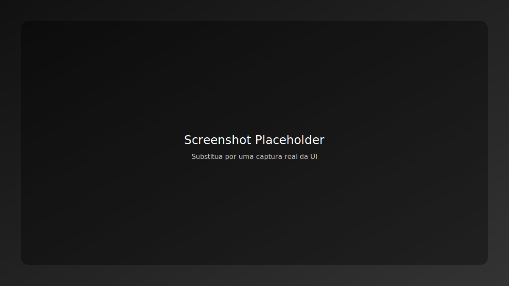

# JP Marcenaria Digital

Projeto open-source de landing page e portfólio profissional, com integração a Supabase, UI moderna com shadcn-ui/Tailwind e pipeline CI/CD. Otimizado para deploy contínuo na Vercel e testes E2E com Playwright.


## Descrição
- Landing page e portfólio com componentes acessíveis e responsivos.
- Páginas principais: Portfólio, Briefing, Foto Magia IA, Materiais.
- Integrações: Supabase para dados, Playwright para E2E, Docker para dev/CI.
- Deploy contínuo via GitHub Actions + Vercel.

## Requisitos de Sistema
- `Node.js 20.x`
- `npm` ou `pnpm`
- Opcional: `Docker` e `Vercel CLI`

## Instalação e Configuração
1. Clone o repositório:
   ```sh
   git clone https://github.com/jpmarcenaria/jp-marcenaria-digital.git
   cd jp-marcenaria-digital
   ```
2. Instale as dependências:
   ```sh
   npm ci
   # ou
   pnpm install
   ```
3. Configure variáveis de ambiente:
   - Copie `.env.example` para `.env` e ajuste os valores.
   - Consulte `docs/environment.md` para detalhes e recomendações.
4. Desenvolvimento local:
   ```sh
   npm run dev
   # Acesse http://localhost:5173/
   ```
5. Build de produção:
   ```sh
   npm run build
   npm run preview
   # Acesse http://localhost:4173/
   ```

## Exemplos de Uso
- Rodar testes E2E:
  ```sh
  npm run test:e2e
  npm run test:e2e:report
  ```
- Monitoramento/Security (local):
  ```sh
  npm run security:report
  npm run security:ci
  ```

## Deploy na Vercel
- Arquivo `vercel.json` já configurado com:
  - `buildCommand: npm run build`
  - `outputDirectory: dist`
  - `rewrites` para SPA
  - `headers` de segurança (X-Content-Type-Options, X-Frame-Options, X-XSS-Protection)
- Passos:
  1. Conecte o repositório no dashboard da Vercel.
  2. Configure variáveis de ambiente (Produção/Preview/Desenvolvimento).
  3. Verifique scripts de build no `package.json`.
  4. Push para `main` dispara deploy de produção.
- Consulte `docs/deployment-vercel.md` e `VERCEL_SETUP.md`.

## CI/CD
- Workflow principal: `.github/workflows/ci-cd.yml`
  - Lint, build, testes E2E, scan de segurança (Trivy), build Docker e deploy.
- Atualização automática de dependências: `.github/workflows/dependency-update.yml`.

## Estrutura de Pastas
```
jp-marcenaria-digital/
├── src/                 # Código-fonte (React + Vite)
├── public/              # Assets públicos, favicon, sitemap
├── docs/                # Documentação técnica
├── tests/               # Playwright E2E
├── .github/workflows/   # Pipelines CI/CD
├── vercel.json          # Configuração Vercel
├── package.json         # Scripts e dependências
├── README.md            # Este arquivo
```

## Roadmap
- Melhorias de acessibilidade (contraste, navegação por teclado).
- Padronização total do tema escuro em todas as páginas.
- Integração de analytics opt-in e conformidade LGPD.
- Catálogo de materiais com filtros avançados.
- Automação de screenshots e publicação no README.

## Padrões Visuais
- Markdown padronizado (títulos, listas, código).
- Badges de status (CI/CD, licença, versões).
- Diagramas e fluxos em `docs/architecture.md`.
- Screenshots em `docs/screenshots/` (exemplo abaixo).

### Screenshot de exemplo


## Contribuição
- Leia `CONTRIBUTING.md` para guidelines, convenções de commit e fluxo de PR.

## Licença
- MIT — veja `LICENSE`.

## Referências
- `docs/environment.md` — variáveis de ambiente
- `docs/deployment-vercel.md` — deploy na Vercel
- `docs/architecture.md` — arquitetura e componentes
